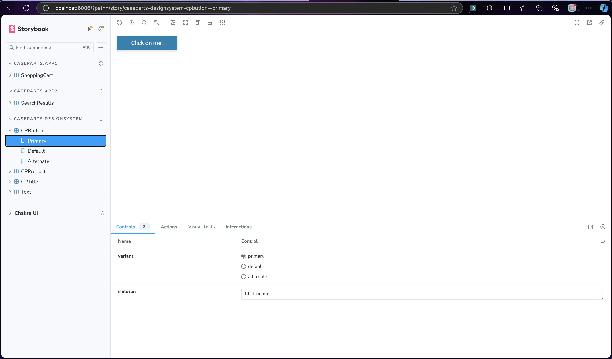

# Design System Demo

This project demonstrates a crude design system/component library.

The component library is built with React, and extends and customizes [Chakra UI](https://v2.chakra-ui.com/). An instance of [StorybookJS](https://storybook.js.org) can be run locally to see the component library in action.

## Getting started

Clone this repo. Then install dependencies, and run the Storybook environment:

```sh
npm install
npm run storybook
```

The running Storybook environment presents multiple applications and a design system driving them both:


